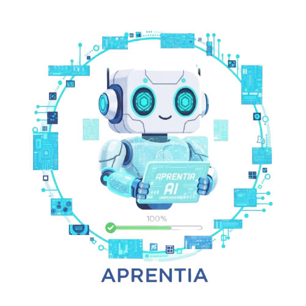
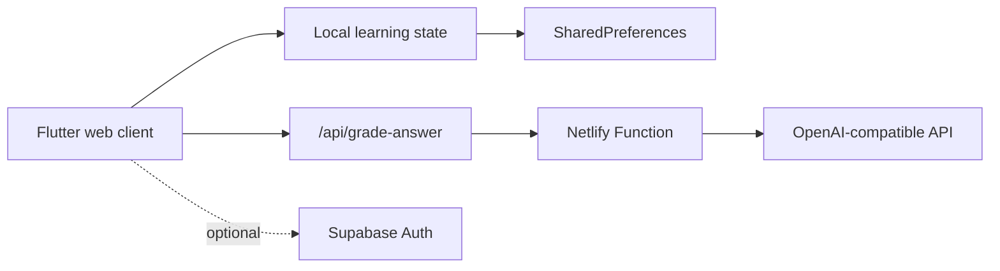

<div align="center">
  

  # Aprentia

  **A playful, AI-assisted learning experience for building practical prompting skills.**

  Flutter | Netlify Functions | OpenAI-compatible APIs | Supabase (optional)
</div>

## About the project

Aprentia turns prompt engineering practice into a guided learning loop: study a focused lesson, try a realistic exercise, receive structured AI feedback, and build momentum through XP, streaks, hearts, and badges.

The project is designed as a portfolio-ready full-stack Flutter application. The browser never receives the AI provider secret; grading requests are routed through a server-side Netlify Function. Authentication can run locally for a zero-configuration demo or use Supabase email OTP when credentials are supplied.

## Highlights

- Structured courses covering prompting fundamentals, verification, email writing, summaries, research, creativity, and workplace use
- AI-graded practice exercises with a score, actionable feedback, and an improved answer
- Gamification through XP, streaks, hearts, progress tracking, and achievement badges
- Local-first guest experience backed by `SharedPreferences`
- Optional Supabase email OTP authentication with automatic local fallback
- Responsive Flutter web interface with Material 3 styling and installable PWA metadata
- Netlify deployment configuration and a serverless grading endpoint

## Architecture



The codebase is organized by feature:

```text
lib/
|-- features/auth/           Local and Supabase authentication adapters
|-- features/courses/        Course models, catalogue, and lesson viewer
|-- features/practice/       Exercise loading, grading, and attempt history
|-- features/achievements/   Badge presentation
|-- features/profile/        Learner profile and progress controls
`-- features/shell/          Shared state and primary navigation
netlify/functions/           Server-side AI grading boundary
assets/                      Practice content and brand artwork
scripts/                     Reproducible Netlify build setup
```

## Run locally

### Prerequisites

- Flutter SDK compatible with Dart `^3.10.7`
- Chrome or another Flutter web target

```bash
git clone https://github.com/eemirex/aprentia.git
cd aprentia
flutter pub get
flutter run -d chrome
```

The app works without external services using guest authentication and local progress. AI grading requires the Netlify Function or a configured endpoint.

### Configuration

`.env.example` documents the supported values. For a local Flutter run, pass client-safe values with Dart defines:

```bash
flutter run -d chrome \
  --dart-define=SUPABASE_URL="your-project-url" \
  --dart-define=SUPABASE_ANON_KEY="your-anon-key" \
  --dart-define=PRACTICE_API_URL="https://your-site.netlify.app/api/grade-answer"
```

Keep `OPENAI_API_KEY` server-side in Netlify. Never pass it to Flutter or commit a populated `.env` file.

| Variable | Where it is used | Required |
| --- | --- | --- |
| `PRACTICE_API_URL` | Flutter client | Optional; defaults to `/api/grade-answer` |
| `SUPABASE_URL` | Flutter client | Optional |
| `SUPABASE_ANON_KEY` | Flutter client | Optional |
| `OPENAI_API_KEY` | Netlify Function | Required when an authenticated upstream is used |
| `OPENAI_BASE_URL` | Netlify Function | Optional; defaults to the OpenAI API |
| `OPENAI_MODEL` | Netlify Function | Optional; defaults to `gpt-4o-mini` |

For local end-to-end grading, run the Flutter build through Netlify Dev or point `PRACTICE_API_URL` at a deployed function.

## Deploy to Netlify

The included `netlify.toml` runs `scripts/netlify_build.sh`, installs Flutter on the build worker, builds a release web bundle, and publishes `build/web`.

1. Import this GitHub repository into Netlify.
2. Add server-side AI configuration in **Site configuration → Environment variables**.
3. Optionally add the Supabase build variables for email OTP.
4. Deploy. The SPA redirect and function route are already configured.

## Security choices

- AI credentials are read only inside the Netlify Function.
- `.env` files, generated builds, coverage output, and IDE metadata are ignored by Git.
- User input and rubric content are length-limited before reaching the model.
- Model scores are clamped to the supported `0–100` range.
- Supabase authentication is optional; the app degrades to a local guest session.

## Validation

Before submitting changes:

```bash
flutter analyze
flutter test
flutter build web --release
```

The Netlify Function can be syntax-checked with:

```bash
node --check netlify/functions/grade-answer.js
```

## Roadmap

- Add more exercise packs and richer course content
- Sync learning progress across devices for authenticated users
- Add automated Flutter widget and state tests
- Add an instructor dashboard and learner analytics
- Package the experience for Android and iOS

## Project status

Aprentia is an actively developed portfolio project. Core learning, practice, progress, authentication fallback, and deployment flows are implemented; production deployment and broader automated test coverage remain on the roadmap.
